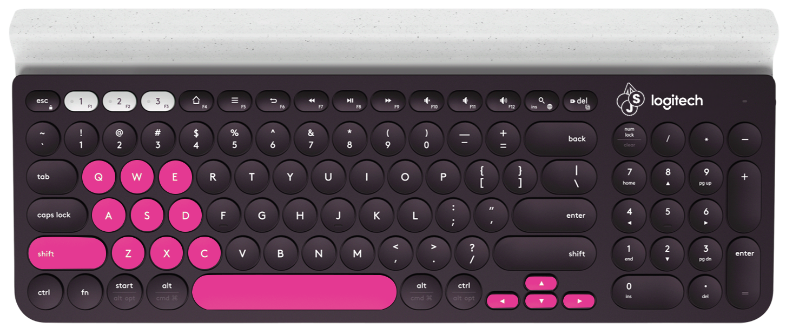

# Welcome to ElderBerryJS

Programmed, designed and documented by **[JMIDEV](https://github.com/JMIDEV)**.


A **JavaScript** **based** Retro focused game engine, that will make your **life easier** when doing things like getting the **mouse position**, getting **keyboard input**, drawing **pixelated circles, rectangles, and lines with the choice of filling them**, drawing **sprites/tiles** that can be **flipped** and **transparent**, creating **objects** that can **collide** with each other, etc...

In this documentation, you'll learn how to use it in a very **intuitive** way, so let's get started!

(Please, I'm Spanish, if you find spelling errors, gramatical errors, etc... Let me know in [Github Issues](https://github.com/ElderBerryJS/ElderBerryJS/issues))

------


# * Getting Started


To get started, you'll need to go to the [repository](https://github.com/ElderBerryJS/ElderBerryJS-GameEngine), and click on the Download Code button:


And then, select download ZIP. That way, you will only need to extract the compressed ZIP into a folder, keep only the `ElderBerryJS GameEngine` folder, and once you do that, inside of that folder you'll have all of the Engine files for creating your first project.

The folder has the next files/folders:

```
\internals:

	...

\yourfiles:

	[EMPTY]

\BG.jpg

\TFDU.png

\index.html

\yourcode.js
```

Inside the `internals` folder, you'll not need to touch anything, since inside there are the scripts that make the Engine work, and by the moment, the folder called `yourfiles` will not be used, but in the main folder, at any moment you'll need to edit any of those four files, principally `yourcode.js`, so let's take a look at them:

- `yourcode.js`: This is **the most important file** you'll use, since here you will write **your own code for your game**, including **creating objects, drawing text, and all the things involved in creating the game.**

- `BG.jpg`: This is the background that will be shown outside of the drawing canvas. By default, it will look like this, but you can modify it if you want:

  ​	

- `TFDU.png`: Here you will place ALL THE IMAGES/TILES that will be used on your project, ONLY HERE, so yeah, you will need to "crop" the image during code, but you'll later see it's not that hard.

- `index.html`: This file is the one that browsers will load so people can play your games. This file calls all the scripts of the engine, and also `yourcode.js`.

------


# * Test / play / try your project


This engine works using something called "JavaScript modules", which don't work if you only double click the `index.html` file.

For testing your project, you'll need to "localhost" it, and for that, we'll use PYTHON.

First of all, you'll need to install python, by going to [Python's website](https://www.python.org/) (If you are using a Linux distribution, you probably already have python on your system, and if you don't know if you have it, in any system, go to the terminal and write `python --version`, and then, if you have python, you'll see the number of the current python version installed).

Once you have python, go to your system terminal and then navigate with `cd [Folder]` to the folder where you have the files `yourcode.js`, `index.html`......

<u>For example</u>, if you have your project in a folder inside the "C:\" drive called "ebproject", you need to enter `cd C:\ebproject`.

Once there, you'll need to enter a command depending on your system:

```python
#In Mac/Linux:
python -m SimpleHTTPServer
#In Windows:
python -m http.server
```

Then, you just need to open your web browser and go to `http://localhost:8000/`.

If you have done everything right, you'll see the pre-established program, which just shows this:


## **\ IMPORTANT:**

Along development, you'll need to reload the localhost to see the changes reflected, but sometimes, it may not update some files, or simply not change anything, and probably, it will not be your fault, because there is something called, CACHE, which saves content from websites in a temporal memory to save web load time, but it can lead to things like this.

To avoid that, everytime you reload the localhost, press `Ctrl + F5`, and then, your game will be reloaded with cache erased!!

------


# * Preparing things for your projects


Once you have your project where you want it to be, you'll need to open `yourcode.js` with your favourite code editor **(I recommend using Visual Studio Code, since it will autocomplete a lot of things and will make your work flow faster and easier).**

Now, you probably don't want to keep the little "Welcome to ElderBerryJS!!" message, so let's delete some things from the code.

That way erase the entire `yourcode.js` content, and copy/paste all this:

```javascript
//DON'T TOUCH. Only touch if you want to add more modules.

import * as conform_unit from './internals/conform.js';               //DEDICATED TO THE CANVAS AND GENERATION OF THINGS
import * as draw_unit from './internals/graphics.js';                 //DRAWING CIRCLES, LINES, IMAGES/TILES, etc...
import * as input_unit from './internals/input.js';                   //GET KEYBOARD/MOUSE HOLDS, GET THE MOUSE's POSITION, etc...
import * as objects_unit from './internals/objectsystem.js';          //GENERATE OBJECTS, DESTROY THEM, DETECT COLLISIONS, etc...
import * as sound_unit from './internals/sound.js';                   //PLAY MUSIC/SFX

//PREPARING THINGS

conform_unit.conform("disp_res", 1024, 768);                          //CANVAS SIZE
conform_unit.conform("disp_Iscale", 4);                               //ONE PIXEL IS FOUR PIXELS IN THE CANVAS
conform_unit.conform("disp_bg", "#000000");                           //CANVAS BACKGROUND IN HEXADECIMAL
conform_unit.conform("disp_canvas", 1);                               //GENERATING THE CANVAS
conform_unit.conform("app_title", "ElderberryJS App");                //NAME OF THE WINDOW/TAB

objects_unit.setcolwireframe(false);                                  //SEE THE COLLISION BOXES OF THE OBJECTS

//CAMERA (ONLY ONE)

export var E_camera = new draw_unit.camera();                         // CAMERA OBJECT

//CREATE OBJECTS HERE


//YOUR VARS


//EXECUTED AT THE BEGINNING

export function Start(){

    

}

//EXECUTED EVERY FRAME BEFORE THE OBJECTS HAVE BEEN RENDERED

export function Update(){

    
    
}

//EXECUTED EVERY FRAME AFTER THE OBJECTS HAVE BEEN RENDERED

export function AfterObjectsUpdate(){

    

}

//MOUSE BUTTON DOWN/UP

export function Mouse(mode, situation){

    if(mode == "Down"){

        if(situation == "Left"){

            //Left mouse button pressed
    
        }
    
        if(situation == "Middle"){
    
            //Middle mouse button pressed
    
        }
    
        if(situation == "Right"){
    
            //Middle mouse button pressed
    
        }

    }

    if(mode == "Up"){

        if(situation == "Left"){

            //Left mouse button lifted
    
        }
    
        if(situation == "Middle"){
    
            //Middle mouse button lifted
    
        }
    
        if(situation == "Right"){
    
            //Middle mouse button lifted
    
        }

    }

}

//KEY DOWN/UP

export function Keyboard(mode, situation){

    if(mode == "Down"){
        
        //Key is pressed down

    }

    if(mode == "Up"){
        
        //Key is lifted up

        

    }

}
```

------


# * Conforming the canvas:


You may ask, how's that there isn't a canvas in the HTML file, but there are things rendered to a canvas.

That's because of the CONFORM UNIT.

The `conform_unit` is the unit that you'll use for generating your canvas, getting its width, etc...

By default, you can see that the conform is already prepared with these lines:

```javascript
conform_unit.conform("disp_res", 1024, 768);
conform_unit.conform("disp_Iscale", 4);
conform_unit.conform("disp_bg", "#000000");
conform_unit.conform("disp_canvas", 1);
conform_unit.conform("app_title", "ElderberryJS App");
```

 But let's take a look at the different functionalities that this unit is able to give us:


## \ The **conform();** function

This is the function dedicated to generating the canvas, changing its resolution, changing its scale (real screen pixels per internal pixel), the color of the background of the canvas, and changing the name of the program. **<u>It needs to run after the imports</u>**. Let's take a look at the different things that the function can do:

### Change the size of  the canvas in width/height pixels ("disp_res")

```javascript
conform_unit.conform("disp_res", PIXELS_WIDTH, PIXELS_HEIGHT);
//Example
conform_unit.conform("disp_res", 1024, 768);
```


### Change how many real pixels there are for an internal pixel ("disp_Iscale") <u>(Works like the scale of a map)</u>

```javascript
conform_unit.conform("disp_Iscale", REALPIXELS_PER_INTERNALPIXELS);
//Example
conform_unit.conform("disp_Iscale", 4);
```


### Change internal background color ("disp_bg")

```javascript
conform_unit.conform("disp_bg", COLOR IN HEXADECIMAL);
//Example
conform_unit.conform("disp_bg", "#ff0000");
```


### Create the canvas ("disp_canvas")

```javascript
//Needs to run after all the other "disp_" conforms

conform_unit.conform("disp_canvas", type);

//Example:

conform_unit.conform("disp_canvas", 1); //Align to the center
									 //or
conform_unit.conform("disp_canvas", 2); //Align to the top-left corner
```


### Change the name of  the game/program ("app_title")

```javascript
conform_unit.conform("app_title", TITLE);
//Example
conform_unit.conform("app_title", "My amazing game name HD");
```


## \ Conform unit variables

- `conform_unit.display_canvas`: The HTML canvas generated with `"disp_canvas"` <u>(You shouldn't use it commonly, since later, we'll see the `draw_unit`, that will help us drawing graphics).</u>
- `conform_unit.display_context`: The 2D context of the HTML canvas, also generated with `"disp_canvas"` <u>(The same as with `conform_unit.display_canvas`)</u>.
- `conform_unit.disp_width`: The width of the HTML canvas.
- `conform_unit.disp_height`: The height of the HTML canvas.
- `conform_unit.disp_type`: The type of canvas we assigned in `"disp_canvas"`.
- `conform_unit.disp_Iscale`: The scale you assigned in `"disp_Iscale"` (pixels on the screen per internal pixels).
- `conform_unit.disp_Iwidth`: The width of the screen in internal pixels (REAL PIXELS / SCALE).
- `conform_unit.disp_Iheight`: The height of the screen in internal pixels (REAL PIXELS / SCALE).
- `conform_unit.disp_bg`: The background color you did set in `"disp_bg"`.
- `conform_unit.app_title`: The title you did set in `"app_title"`.

------


# * Drawing on the canvas:

For drawing graphics on the canvas, we'll be using the `draw_unit`, that is able to draw individual pixels, lines, circles, rectangles, tiles/images, and text.

The draw functions we are going to see later need to be written inside:

```javascript
export function Update(){

    
    
}
```

 

Or inside:

```javascript
export function AfterObjectsUpdate(){

    

}
```

Because if you write it inside `export function Start()`, the screen refresh will erase it **(Later, we'll talk about objects, that will not need to be redrawn manually, but they can only render TILES or IMAGES).**

Let's take a look at the different draw functions:

## `\ drawPixel()`:

This function needs only three arguments:

- `x`: The X position of the pixel (internal pixels).
- `y`: The Y position of the pixel (internal pixels).
- `color`: The color of the pixel (Hexadecimal colors)

Example:

```javascript
export function Update(){

    draw_unit.drawPixel(8, 8, "#00ff00");
    
}
```

Result:


## `\ drawLine()`:

This function needs only five arguments:

- `x0`: The first point's x.
- `y0`: The first point's y.
- `x1`: The second point's x.
- `y1`: The second point's y.
- `color`: The color of the line (Hexadecimal colors)

Example:

```javascript
export function Update(){

    draw_unit.drawLine(8, 8, 32, 32, "#0000ff")
    
}
```

Result:


## `\ drawCircle()`:

This function needs only six arguments:

- `filled`: 0: Not filled, 1: Filled, 2: Both.
- `x`: X position of the circle by its top-left corner.
- `y`: Y position of the circle by its top-left corner.
- `size`: One number correspondent to the width and height of the circle (The width and height are the same).
- `internal_color`: The color in hexadecimal for filled circles.
- `external_color`: The color in hexadecimal for non-filled circles.

Example:

```javascript
export function Update(){

    draw_unit.drawCircle(0, 0, 0, 32, "#ff0000", "#00ff00");    //NOT FILLED
    draw_unit.drawCircle(1, 32, 0, 32, "#ff0000", "#00ff00");   //FILLED
    draw_unit.drawCircle(2, 64, 0, 32, "#ff0000", "#00ff00");   //BOTH
    
}
```

Result:


## `\ drawRect()`:

This function needs only seven arguments:

- `filled`: 0: Not filled, 1: Filled, 2: Both.
- `x`: X position of the rectangle by its top-left corner.
- `y`: Y position of the rectangle by its top-left corner.
- `width`: Width of the rectangle.
- `height`: Height of the rectangle.
- `internal_color`: The color in hexadecimal for filled rectangles.
- `external_color`: The color in hexadecimal for non-filled rectangles.

Example:

```javascript
export function Update(){

    draw_unit.drawRect(0, 0, 0, 32, 16, "#ff00ff", "#00ff00");     //NOT FILLED
    draw_unit.drawRect(1, 0, 16, 32, 16, "#ff00ff", "#00ff00");    //FILLED
    draw_unit.drawRect(2, 0, 32, 32, 16, "#ff00ff", "#00ff00");    //BOTH
    
}
```

Result:


## `\ drawText()`:

This function needs only five arguments:

- `Font`: There's only one font available by the moment, which is `draw_unit.Font_Arcade`.
- `Text`: The text displayed.
- `Color`: The color of the text in hexadecimal.
- `x`: The X position of the text:.
- `y`: The Y position of the text.

Example:

```javascript
export function Update(){

    draw_unit.drawText(draw_unit.Font_Arcade, "Lorem ipsum dolor sit amet.", "#ffffff", 0, 0);     //WHITE
    draw_unit.drawText(draw_unit.Font_Arcade, "Lorem ipsum dolor sit amet.", "#ff0000", 0, 8);     //RED
    draw_unit.drawText(draw_unit.Font_Arcade, "Lorem ipsum dolor sit amet.", "#00ff00", 0, 16);    //GREEN
    draw_unit.drawText(draw_unit.Font_Arcade, "Lorem ipsum dolor sit amet.", "#0000ff", 0, 24);    //BLUE
    
}
```

Result:


## `\ drawTile()`:

Now, let's get a little bit technical.

Old systems, such as the **Sega Master System**, the **NES**, the **Sega Genesis**, and all the other devices of the time, stored graphics in a **table**, which, is basically one single image, divided by **8x8** tiles. Then, for rendering **sprites**, they needed to **cut** parts of the table to render the sprites, and in some cases, **combine** sprites/tiles to create sprites bigger than 8x8.

**ElderBerryJS** uses something similar, but **easier**, because we can draw tiles/sprites **bigger than 8x8** without combining. Remember that file called `TFDU.png`?? Well, in that PNG file, we are going to store **all the sprite graphics of your project** (the file can be as bigger as you want).

By default, for the pre-established program, the **TFDU** **(Tiles for drawing unit)** has these graphics for the blue ball and the EBJS logo:


But for this example, we'll use a sprite pack from a website called [**OPENGAMEART.org**](https://opengameart.org), called [**BEASTLANDS**](https://opengameart.org/content/beastlands), made by [**Surt**](https://opengameart.org/users/surt).

I have picked a few tiles from the pack, and made this TFDU:


For drawing the sprites we'll call the `drawtile();` function, that will crop the TFDU image **(and that image only, don't rename the TFDU file, or add a new one, the engine only reads from TFDU.png)** by saying the x and y offset of the crop, and the width and height of the crop.

Let's take a look at the different arguments of the function, and later, we'll explain a few things:

- `tile_offset_x`: The X coordinate inside TFDU.png to start clipping the tile.
- `tile_offset_y`: The Y coordinate inside TFDU.png to start clipping the tile.
- `tile_offset_width`: The Width of the clipping inside TFDU.png.
- `tile_offset_height`: The Height of the clipping inside TFDU.png.
- `x`: The X position to draw the clipped tile.
- `y`: The Y position to draw the clipped tile.
- `flippedx`: Write `true` to flip horizontally. Write `false` to not flip.
- `flippedy`: Write `true` to flip vertically. Write `false` to not flip.
- `opacity`: Opacity from 0 to 1. For example, `0.5` would be 50% opacity.

Now, let's understand how to **clip** images from the TFDU. Let's try dividing the tilemap into, for example, 8x8 tiles:


And now, let's try cropping the metal box:


The red lines are the `tile_offset_x` and the `tile_offset_y`, and the green ones are the `tile_offset_width` and the `tile_offset_height`.

With that done, let's draw that box at the position (8,8):

```javascript
export function Update(){

	draw_unit.drawTile(8,0,16,16,8,8,false,false,1);

}
```

And this is the result:


That way, combining different tiles, we can make different sceneries like this very simple one:

```javascript
//WE DID ALSO ESTABLISH conform_unit.conform("disp_bg", "#00e5ff");  

export function Update(){

    //BLOCKS

    draw_unit.drawTile(8,0,16,16,8,24,false,false,1);
    draw_unit.drawTile(8,0,16,16,24,24,false,false,1);
    draw_unit.drawTile(8,0,16,16,40,24,false,false,1);
    draw_unit.drawTile(8,0,16,16,56,24,false,false,1);
    draw_unit.drawTile(8,0,16,16,72,24,false,false,1);
    draw_unit.drawTile(8,0,16,16,88,24,false,false,1);
    
    //FLOWERS

    draw_unit.drawTile(0,0,8,8,16,16,false,false,1);      //NORMAL
    draw_unit.drawTile(0,0,8,8,32,16,false,false,0.5);    //OPACITY 50%
    draw_unit.drawTile(0,0,8,8,48,16,true,true,1);        //FLIPPED HORIZONTALLY AND VERTICALLY

    //SIGN AND WATERMELON

    draw_unit.drawTile(0,16,16,24,64,0,false,false,1);    //SIGN
    draw_unit.drawTile(24,0,16,16,80,8,false,false,1);    //WATERMELON

}
```

Result:


------


# * Getting Input from the user

For getting inputs from the mouse and the keyboard, we'll be accessing the `input_unit`.

Let's get started by reading **keyboard inputs**.

## \ Keyboard inputs



In that example keyboard, the keys that are **pink**, are the keys that we'll be able to read in **ElderBerryJS**.

**(The reason why we can't read the rest of keys, is that, if we checked all the keys, we would get a lot of delay (I tried), and also, that way, we have the classic limitation of buttons of retro consoles, and we don't really need more buttons)**

Now let's take a look at the different things we can do with the Keyboard:

### Key held:

For each key, there is a `boolean`, that will be `true` if that key is being held, and `false` if it isn't.

These are the booleans we can access:

```
input_unit.up_pressed
input_unit.down_pressed
input_unit.left_pressed
input_unit.right_pressed

input_unit.z_pressed
input_unit.x_pressed
input_unit.c_pressed
input_unit.a_pressed
input_unit.s_pressed
input_unit.d_pressed
input_unit.q_pressed
input_unit.w_pressed
input_unit.e_pressed

input_unit.space_pressed
input_unit.shift_pressed
```

That way, if we want to check if the **right arrow** is held, we do this inside Update:

```javascript
export function Update(){

    if(input_unit.right_pressed){

        //DO WHAT YOU WANT WHEN RIGHT HELD

    }
   
}
```

### Key down/up:

For checking if a key was just pressed, or lifted, we'll not read anything from the `input_unit`, since, we already have a function that will read that, the `Keyboard()` function, at the bottom of `yourcode.js`:

```javascript
export function Keyboard(mode, situation){

    if(mode == "Down"){
        
        //Key is pressed down

    }

    if(mode == "Up"){
        
        //Key is lifted up

    }

}
```

By default, it looks like that, but if we want to receive input, we'll need to put more IFs inside any of the two already existing IFs:

```javascript
//LEFT ARROW -----------------------------------------

if(situation == "left"){
    
    //DO WHAT YOU WANT
    
}

//RIGHT ARROW -----------------------------------------

if(situation == "right"){
    
    //DO WHAT YOU WANT
    
}

//DOWN ARROW -----------------------------------------

if(situation == "down"){
    
    //DO WHAT YOU WANT
    
}

//UP ARROW -----------------------------------------

if(situation == "up"){
    
    //DO WHAT YOU WANT
    
}

// Z -----------------------------------------

if(situation == "z"){
    
    //DO WHAT YOU WANT
    
}

// X -----------------------------------------

if(situation == "x"){
    
    //DO WHAT YOU WANT
    
}

// C -----------------------------------------

if(situation == "c"){
    
    //DO WHAT YOU WANT
    
}

// A -----------------------------------------

if(situation == "a"){
    
    //DO WHAT YOU WANT
    
}

// S -----------------------------------------

if(situation == "s"){
    
    //DO WHAT YOU WANT
    
}

// D -----------------------------------------

if(situation == "d"){
    
    //DO WHAT YOU WANT
    
}

// Q -----------------------------------------

if(situation == "q"){
    
    //DO WHAT YOU WANT
    
}

// W -----------------------------------------

if(situation == "w"){
    
    //DO WHAT YOU WANT
    
}

// E -----------------------------------------

if(situation == "e"){
    
    //DO WHAT YOU WANT
    
}

// SPACE -----------------------------------------

if(situation == "space"){
    
    //DO WHAT YOU WANT
    
}

// SHIFT -----------------------------------------

if(situation == "shift"){
    
    //DO WHAT YOU WANT
    
}
```

For example, let's do that the scenery from before:


Will only be drawn if a boolean `drawscenerytest` is `true`, and if we press down **Z**, that boolean will be `true`, and when we lift **A**, it will be `false`:

```javascript
//DECLARING drawscenerytest

var drawscenerytest = false;

//THE UPDATE FUNCTION

export function Update(){

    if(drawscenerytest){

        //BLOCKS

        draw_unit.drawTile(8,0,16,16,8,24,false,false,1);
        draw_unit.drawTile(8,0,16,16,24,24,false,false,1);
        draw_unit.drawTile(8,0,16,16,40,24,false,false,1);
        draw_unit.drawTile(8,0,16,16,56,24,false,false,1);
        draw_unit.drawTile(8,0,16,16,72,24,false,false,1);
        draw_unit.drawTile(8,0,16,16,88,24,false,false,1);

        //FLOWERS

        draw_unit.drawTile(0,0,8,8,16,16,false,false,1);      //NORMAL
        draw_unit.drawTile(0,0,8,8,32,16,false,false,0.5);    //OPACITY 50%
        draw_unit.drawTile(0,0,8,8,48,16,true,true,1);        //FLIPPED HORIZONTALLY AND VERTICALLY

        //SIGN AND WATERMELON

        draw_unit.drawTile(0,16,16,24,64,0,false,false,1);    //SIGN
        draw_unit.drawTile(24,0,16,16,80,8,false,false,1);    //WATERMELON

    }

}

//THE Keyboard(); FUNCTION

export function Keyboard(mode, situation){

    if(mode == "Down"){
        
        //Key is pressed down

        if(situation == "z"){

            drawscenerytest = true;
        
        }

    }

    if(mode == "Up"){
        
        //Key is lifted up

        if(situation == "a"){

            drawscenerytest = false;
        
        }

    }

}
```

Result:

(BEFORE)


(Z DOWN)


(A LIFTED)


## \ Mouse inputs


Unlike the keyboard, we'll be able to get **a lot of data** from the mouse:

- Button **holding**, **pressing**, or **lifting**.
- Getting **mouse wheel movement**.
- Getting **mouse position** relative to the game canvas.

### Button held:

Just like with the keyboard, we got three `booleans` that are `true` if the button is held and `false` if not:

```
input_unit.Lmouse_Press //LEFT MOUSE BUTTON
input_unit.Mmouse_Press //MIDDLE MOUSE BUTTON
input_unit.Rmouse_Press //RIGHT MOUSE BUTTON
```

That way, enter that in a IF inside Update, and you'll be able to receive mouse buttons' holding.

```javascript
export function Update(){

    if(input_unit.Lmouse_Press){

		//DO WHAT YOU WANT WHEN LEFT MOUSE BUTTON HELD

    }
    
}
```

### Button Down/Up:

Now, the function that we'll use for receiving mouse buttons' press and lifting, is the `Mouse()` function, before the `Keyboard()` function:

```javascript
export function Mouse(mode, situation){

    if(mode == "Down"){

        if(situation == "Left"){

            //Left mouse button pressed
    
        }
    
        if(situation == "Middle"){
    
            //Middle mouse button pressed
    
        }
    
        if(situation == "Right"){
    
            //Middle mouse button pressed
    
        }

    }

    if(mode == "Up"){

        if(situation == "Left"){

            //Left mouse button lifted
    
        }
    
        if(situation == "Middle"){
    
            //Middle mouse button lifted
    
        }
    
        if(situation == "Right"){
    
            //Middle mouse button lifted
    
        }

    }

}
```

You can see that everything is already written, so just put your code where needed and you'll be done!!

### Mouse wheel movement:

For receiving the mouse wheel movement, we'll access a value on the `input_unit`:

```
input_unit.Mmouse_Dir
```

That works like this:

- If the mouse wheel is moving **up**, its value will be `"Up"`.
- If the mouse wheel is moving **down**, its value will be `"Down"`.
- If the mouse wheel **isn't moving**, its value will be `"Stop"`.

That way, by using IFs, you can detect mouse wheel movement.

### Mouse position:

For reading the **mouse position**, we'll access two values from the `input_unit`:

```
input_unit.Input_ImouseX
input_unit.Input_ImouseY
```

That way, we can do just like in the pre-established program, where the blue ball is in the mouse position:


# * Creating objects

Objects in **ElderBerryJS** are variables, that can detect **collisions with other objects**, and render **their own tiles/images** from the `TFDU.png`.

For creating objects, we'll access the `objects_unit`'s `E_Object`. The syntax looks like this:

```javascript
var Test_Object = new objects_unit.E_Object( diff , x , y , tile_offset_x , tile_offset_y , tile_offset_width , tile_offset_height , col_left , col_right , col_top , col_bottom , flippedX , flippedY , opacity );
```

It may seem a little bit confusing, so let's take a look at each of the arguments:

- `diff`: You can use it to classify objects, and later, by writing:

```javascript
objects_unit.E_Objects.forEach(function(obj){

    if(obj.diff == "yourpreferred"){

        //DO WHATEVER YOU WANT FOR EACH OBJECT WITH THAT DIFF.
        //ACCESS A PROPERTY OF THE OBJECT BY obj.property.

    }

    //IF YOU DON'T SPECIFY A DIFF, THAT CODE WILL RUN FOR ALL OBJECTS.

});
```

You can do whatever you want to each object with a specific **diff**, or do anything for all objects.


- `x`: The X position to draw the object.
- `y`: The Y position to draw the object.
- `tile_offset_x`: The **tile_offset_x** of its tile. **Go back to the DRAWTILE section to learn more about it.**
- `tile_offset_y`: The **tile_offset_y** of its tile. **Go back to the DRAWTILE section to learn more about it.**
- `tile_offset_with`: The **tile_offset_with** of its tile. **Go back to the DRAWTILE section to learn more about it.**
- `tile_offset_height`: The **tile_offset_height** of its tile. **Go back to the DRAWTILE section to learn more about it.**
- `col_left`: The **Left margin** of the collision inside the drawn tile's box.
- `col_right`: The **Right margin** of the collision inside the drawn tile's box.
- `col_top`: The **Top margin** of the collision inside the drawn tile's box.
- `col_bottom`: The **Top margin** of the collision inside the drawn tile's box.
- `flippedX`: The **Horizontal flipping** of the object's tile.
- `flippedY`: The **Vertical flipping** of the object's tile.
- `opacity`: The **Opacity** of the object's tile. **Go back to the DRAWTILE section to learn more about it.**

## \ Reading / changing properties of objects

To read/modify one of the properties you'll access it by `objectname` + `.` + `property`

For example:

```javascript
var ball = new objects_unit.E_Object("ball", 0, 0, 0, 0, 8, 8, 0, 0, 0, 0, false, false, 1);

//CHANGING X IF X IS 0

if(ball.x == 0){
    
    ball.x = 8;
    
}
```

**IMPORTANT: DON'T MODIFY THE colbottom<u>side</u>/coltop<u>side</u>/colright<u>side</u>/colleft<u>side</u> since these values are internals, and they will not change if you touch them. Change <u>colbottom</u>/<u>coltop</u>/<u>colright</u>/<u>colleft</u> instead**

## \ Understanding collisions

For example, imagine that we have this character:


We can see that his collision, should be less than 16x16 pixels, so let's try shrinking the collision to make it fit the space that we want:


How do we do this with **ElderBerryJS'** collision system?? Well, let's take a look:


The green lines are `col_right` and `col_left`, and the orange lines are `col_top` and `col_bottom`.

We can see that, as said before, we are just working with **margins** around an image to define a **collision box**.

## \ Previewing collisions

By the moment, our project, using **the character we just designed**, and applying the **collisions** into an object, looks like this:

TFDU:


CODE:

```javascript
var Character = new objects_unit.E_Object("", 0, 0, 0, 0, 16, 16, 4, 3, 1, 0, false, false, 1);
```

RESULT:


We can see the image, but **we don't have any way of knowing if the collisions are being well prepared**.

For checking the collisions, you'll need to go to the beginning of `yourcode.js`, and look at **this line**:

```javascript
objects_unit.setcolwireframe(false);
```

If you want to see the collisions, change `false` to `true` inside the brackets, and you'll see this:


**Now you can see the collision box in that pink box!!**


## \ Detecting collisions

Even though this may seem hard, it's really easy!! You just need to access `colliding()`  from the `objects_unit`:

```javascript
if(objects_unit.colliding(obj1, obj2)){

        //DO WHAT YOU WANT

}
```

You can see that you only need to replace `obj1` with one object, and `obj2` with another one, and then, put the code you want inside the IF.

For example:

I have updated the code and the TFDU to add a new character:


```javascript
var Character = new objects_unit.E_Object("", 0, 0, 0, 0, 16, 16, 4, 3, 1, 0, false, false, 1);
var Slime = new objects_unit.E_Object("", 64, 64, 16, 0, 8, 8, 1, 1, 1, 1, false, false, 1);
```


Now let's draw text when they collide:

```javascript
export function Update(){

    if(objects_unit.colliding(Character, Slime)){

        draw_unit.drawText(draw_unit.Font_Arcade, "Colliding!!", "#ffffff", 72, 72);

    }

}
```

Not colliding:


Colliding:


## \ Destroying objects

To delete objects, is as easy as using the `objects_unit.destroy()` function:

```javascript
objects_unit.destroy(Objecttodestroy);
```

For example, let's make that the collision example from before, makes the slime dissapear:

```javascript
export function Update(){

    if(objects_unit.colliding(Character, Slime)){

        objects_unit.destroy(Slime);

    }

}
```

Not colliding:


Colliding:


# * Changing camera's position

The camera in ElderBerryJS is an **object** in itself, so to move it, we just need to modify the X/Y position of the `E_camera` Object:

```javascript
E_camera.x = 16; //Camera's x is now 16
E_camera.y = 32; //Camera's y is now 32
```

That way we can change from this from before:


To this with the camera pointing at the Slime (only at the beginning):

```javascript
export function Start(){

    E_camera.x = Slime.x;
    E_camera.y = Slime.y;

}
```


# * Playing sound **(BETA)**

The sound playing functionalities are in a **BETA** state, since is a little bit **badly coded**, but let's take a look at the current functionalities:

To play sound, we'll use the `sound_unit`'s `playSound()` function.

First of all, put your music in the same directory as `yourcode.js`, and then for each music file, create a variable with the file name written like this example:

```javascript
var song = new Audio("song.mp3");
```

Then, inside Update, write this:

```javascript
export function Update(){

	sound_unit.playSound(song);

}
```

Then, if you play your game, you may see that you can't hear anything. That's because you need to do an user input to start the sound (that's something that every popular browser does for security reasons). So yeah, if you press a key or click, from now on you'll hear sound.

# * Exporting

That's not available yet. Something what you can do is host online the game with something like [Github Pages](https://pages.github.com/), but take in count that people will be able to see your code.

# * What to do now

- Report any issue at [https://github.com/ElderBerryJS/ElderBerryJS/issues](https://github.com/ElderBerryJS/ElderBerryJS/issues)
- Make questions or discuss anything in [https://github.com/ElderBerryJS/ElderBerryJS/discussions](https://github.com/ElderBerryJS/ElderBerryJS/discussions)
- Create!!
